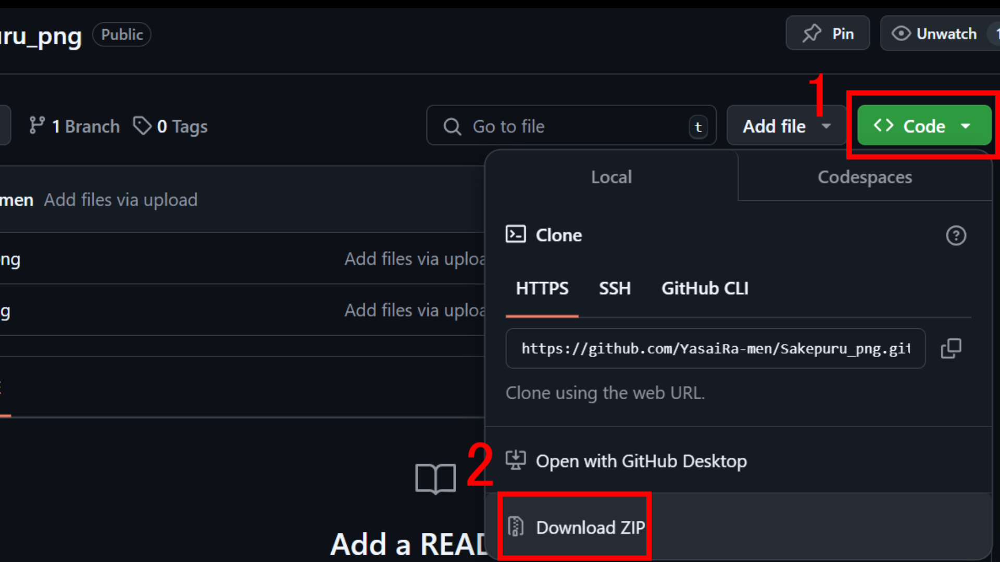

---
var:
    header-title: "オンラインテキストテンプレート"
    header-date: "2024/04/23"
---

# JavaScript でゲームを作ろう

## まずはステージを作成しよう

### 枠の作成

-   まずは、HTML と CSS を使って簡単なステージを作ってみよう。

-   始めに、新しくフォルダを作りましょう。

-   そのフォルダ内に`index.html`という HTML ファイルを作成します。

-   `!`を書いて、HTML の雛形を書こう！

```html{.numberLines caption="index.html"}
<!DOCTYPE html>
<html lang="ja">
<head>
    <meta charset="UTF-8">
    <meta name="viewport" content="width=device-width, initial-scale=1.0">
    <title>避けプル</title>
</head>
<body>
</body>
</html>
```

-   ここからはゲームのサイズや配置を決めます。


-   ただし、ブラウザは見る端末によって大きさ・縦横比が変わってきます。


-   今回は、スマホをメインにすることから縦長にします。

```html{.numberLines caption="index.html"}
<!DOCTYPE html>
<html lang="ja">
<head>
    <meta charset="UTF-8">
    <meta name="viewport" content="width=device-width, initial-scale=1.0">
    <title>避けプル</title>
    <link rel="stylesheet" href="style.css">
</head>
<body>
    <main>
      <!--ゲーム画面の大きさ-->
        <div id="mainWindow">

            <!--主人公の移動領域-->
            <div id="targetField"></div>

            <!--ゲームタイトル-->
            <div id="gameTitle">
                <div>避けプル</div>
                <button id="startButton">スタート</button>
            </div>

        </div>
    </main>
</body>
</html>
```

```css{.numberLines caption="style.css"}
html,
body {
    overflow: hidden;
    height: 100%;
}

body {
    margin: 0px;
}

main {
    transform: translateX(50%);
    width: 100%;
    height: 100%;
}

#mainWindow {
    background-color: rgb(3, 50, 151);
    height: 100%;
    aspect-ratio: 9 / 16;
    transform: translateX(-50%);
}

#gameTitle {
    position: absolute;
    color: white;
    top: 50%;
    left: 50%;
    transform: translate(-50%, -50%);
}

#targetField {
    background-color: rgb(85, 131, 233);
    position: absolute;
    width: 100%;
    height: 100px;
    bottom: 100px;
    z-index: -1;
}
```

-   この 2 つを実行すると、以下のようになります。

<iframe height="300" style="width: 100%; height: 600px;" scrolling="no" title="Untitled" src="https://codepen.io/YasaiRa-men/embed/oNOKKry?default-tab=html%2Cresult&editable=true" frameborder="no" loading="lazy" allowtransparency="true" allowfullscreen="true">
  See the Pen <a href="https://codepen.io/YasaiRa-men/pen/oNOKKry">
  Untitled</a> by バナナフライ (<a href="https://codepen.io/YasaiRa-men">@YasaiRa-men</a>)
  on <a href="https://codepen.io">CodePen</a>.
</iframe>

-   スタートボタンがありますが、まだ何も起きません。

### 主人公の作成

-   次に、ボタンが押されたら主人公が出現するようにしよう。
-   主人公は、のちに JavaScript で操作できるように、"target"という id 属性をつけます。

```html{.numberLines caption="example02.html"}
<!DOCTYPE html>
<html lang="ja">
<head>
    <meta charset="UTF-8">
    <meta name="viewport" content="width=device-width, initial-scale=1.0">
    <title>Game</title>
    <link rel="stylesheet" href="style.css">
</head>
<body>
    <main>
        <div id="mainWindow">

            <div id="targetField"></div>
            <!-- ここに主人公にするdivを配置 -->
            <div id="target"></div>

            <div id="gameTitle">
                <div>避けゲー</div>
                <button id="startButton">スタート</button>
            </div>

        </div>
    </main>
</body>
</html>
```

-   また、主人公には分かりやすいように色を茶色の丸にしておきます。

```css{.numberLines caption="example01.css"}
html,
body {
    overflow: hidden;
    height: 100%;
}

body {
    margin: 0px;
}

main {
    transform: translateX(50%);
    width: 100%;
    height: 100%;
}

#mainWindow {
    background-color: rgb(3, 50, 151);
    height: 100%;
    aspect-ratio: 9 / 16;
    transform: translateX(-50%);
}

#gameTitle {
    position: absolute;
    color: white;
    top: 50%;
    left: 50%;
    transform: translate(-50%, -50%);
}

/*主人公*/
#target {
    width: 30px;
    height: 30px;
    margin: 0px;
    position: absolute;
    background-color: brown;
    border-radius: 50%;
}

#targetField {
    background-color: rgb(85, 131, 233);
    position: absolute;
    width: 100%;
    height: 100px;
    bottom: 100px;
    z-index: -1;
}
```

-   これによって、このようになりました。

<iframe height="300" style="width: 100%; height: 600px;" scrolling="no" title="Untitled" src="https://codepen.io/YasaiRa-men/embed/pomzzoE?default-tab=html%2Cresult&editable=true" frameborder="no" loading="lazy" allowtransparency="true" allowfullscreen="true">
  See the Pen <a href="https://codepen.io/YasaiRa-men/pen/pomzzoE">
  Untitled</a> by バナナフライ (<a href="https://codepen.io/YasaiRa-men">@YasaiRa-men</a>)
  on <a href="https://codepen.io">CodePen</a>.
</iframe>

-   分かりやすく主人公が出てきましたが、左上にいます。
-   これらも自分で設定していかなければなりません。
-   スタートボタンが押されたら主人公が移動範囲内の中心に出現するようにしよう。
-   中心に配置するために ainme.js を用います。

```html{.numberLines caption="example02.html"}
<!DOCTYPE html>
<html lang="ja">
<head>
    <meta charset="UTF-8">
    <meta name="viewport" content="width=device-width, initial-scale=1.0">
    <title>Game</title>
</head>
<body>
    <main>
        <div id="mainWindow">

            <div id="targetField"></div>
            <!-- ここに主人公にするdivを配置 -->
            <div id="target"></div>

            <div id="gameTitle">
                <div>避けゲー</div>
                <button id="startButton">スタート</button>
            </div>

        </div>
    </main>
    <!--anime.jsを使用-->
    <script src="https://cdnjs.cloudflare.com/ajax/libs/animejs/3.2.1/anime.min.js"></script>
    <script src="main.js"></script>
</body>
</html>
```

```javascript{.numberLines caption="main.js"}
const targetelem = document.getElementById("target");
const startButton = document.getElementById("startButton");
const gameTitle = document.getElementById("gameTitle");

// target を非表示にする
targetelem.style.display = "none";

// スタートボタンのクリックイベント
startButton.addEventListener("click", function () {
    // ゲームタイトルとスタートボタンを非表示にする
    gameTitle.style.display = "none";

    // target を表示する
    targetelem.style.display = "block";

    // 主人公を移動領域の中心に
    anime({
        targets: "#target",
        translateX: targetField.offsetWidth / 2 - targetelem.clientWidth / 2,
        translateY: targetField.offsetTop + targetField.offsetHeight / 2 - targetelem.clientHeight / 2,
        duration: 0,
        easing: "linear",
    });

});
```

<iframe height="300" style="width: 100%; height: 600px;" scrolling="no" title="Example_01" src="https://codepen.io/YasaiRa-men/embed/XWQvLRQ?default-tab=html%2Cresult&editable=true" frameborder="no" loading="lazy" allowtransparency="true" allowfullscreen="true">
  See the Pen <a href="https://codepen.io/YasaiRa-men/pen/XWQvLRQ">
  Example_01</a> by バナナフライ (<a href="https://codepen.io/YasaiRa-men">@YasaiRa-men</a>)
  on <a href="https://codepen.io">CodePen</a>.
</iframe>

## 主人公を動かしてみよう

-   主人公の移動において、移動する範囲を決めた場合、条件分岐を使って主人公が範囲から出ないようにしなければなりません。

<iframe height="300" style="width: 100%; height: 600px;" scrolling="no" title="Example_02" src="https://codepen.io/YasaiRa-men/embed/QWPeXMx?default-tab=html%2Cresult&editable=true" frameborder="no" loading="lazy" allowtransparency="true" allowfullscreen="true">
  See the Pen <a href="https://codepen.io/YasaiRa-men/pen/QWPeXMx">
  Example_02</a> by バナナフライ (<a href="https://codepen.io/YasaiRa-men">@YasaiRa-men</a>)
  on <a href="https://codepen.io">CodePen</a>.
</iframe>

## 障害物を降らせよう

<iframe height="300" style="width: 100%; height: 600px;" scrolling="no" title="Game" src="https://codepen.io/YasaiRa-men/embed/YzMmoKX?default-tab=html%2Cresult&editable=true" frameborder="no" loading="lazy" allowtransparency="true" allowfullscreen="true">
  See the Pen <a href="https://codepen.io/YasaiRa-men/pen/YzMmoKX">
  Game</a> by バナナフライ (<a href="https://codepen.io/YasaiRa-men">@YasaiRa-men</a>)
  on <a href="https://codepen.io">CodePen</a>.
</iframe>

-   画像のリンクは[こちら](https://github.com/YasaiRa-men/Sakepuru_png)から

-   `Code`から`Download ZIP`で画像をダウンロードできます。

-   target の div を img に変えることで、好きな画像に変更できます。


