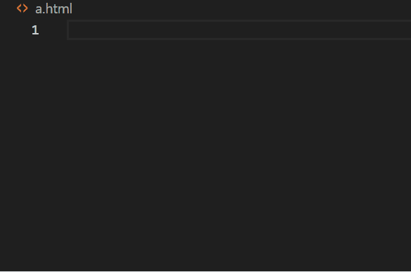
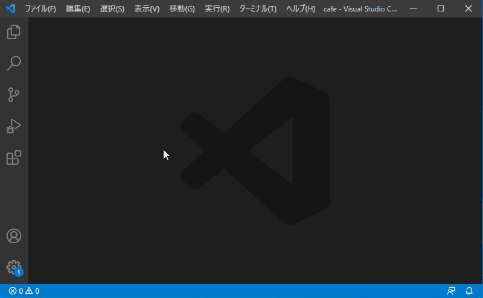

---
var:
    header-title: "オンラインテキストテンプレート"
    header-date: "2024/04/23"
---

# JavaScript でゲームを作ろう

## 概要

## はじめに

-   今回は、HTML の基礎について学びます。
-   HTML はウェブページの骨組みを作るための言語です。
-   まずは、HTML ファイルの基本構造を確認しましょう。

## HTML ファイルの基本構造

-   HTML ファイルは以下のような基本構造を持っています。

```html{.numberLines caption="example.html"}
<!DOCTYPE html>
<html lang="ja">
<head>
  <meta charset="UTF-8">
  <meta name="viewport" content="width=device-width, initial-scale=1.0">
  <title>基本のHTML</title>
</head>
<body>
  <h1>Hello World!</h1>
  <p>これはHTMLの基本構造です。</p>
</body>
</html>
```

<iframe height="300" style="width: 100%;" scrolling="no" title="Untitled" src="https://codepen.io/YasaiRa-men/embed/rNgXxyK?default-tab=html%2Cresult&editable=true" frameborder="no" loading="lazy" allowtransparency="true" allowfullscreen="true">
  See the Pen <a href="https://codepen.io/YasaiRa-men/pen/rNgXxyK">
  Untitled</a> by バナナフライ (<a href="https://codepen.io/YasaiRa-men">@YasaiRa-men</a>)
  on <a href="https://codepen.io">CodePen</a>.
</iframe>

-   ここは HTML を書くときに必要なものですが、今回はそこまで重要ではないので、各部分を軽く説明だけしておきます。

```html{caption="example.html"}
<!DOCTYPE html>: HTML5を使用することを宣言します。
<html lang="ja">: HTML文書の開始を示し、言語を日本語に設定します。
<head>: メタデータ（文字コードやタイトルなど）を含む部分です。
<meta charset="UTF-8">: 文字コードをUTF-8に設定します。
<meta name="viewport" content="width=device-width, initial-scale=1.0">: レスポンシブデザインのための設定です。
<title>: ウェブページのタイトルを設定します。
<body>: 実際に表示される内容を含む部分です。
```

-   なお、これらは最初に半角ビックリマーク<em>!</em>を入力することで雛形を一発で記入してくれます。



-   ただし、この方法だと初期の言語が英語「en」になっているので ja に書き直す必要があります。しかし毎回手動で直すのは面倒なので、自動で ja になるようにしましょう。

<div class="note type-intro">
1. メニューバーから[ファイル] → [ユーザー設定] → [設定]を開く
2. [設定の検索]に、variables と入力する
3. [項目の追加]を、クリックする
4. 項目 lang 、値 ja にして、[OK]をクリックする
</div>



-   これで、`<html lang=”ja”>`で、雛形を作成してくれます。
