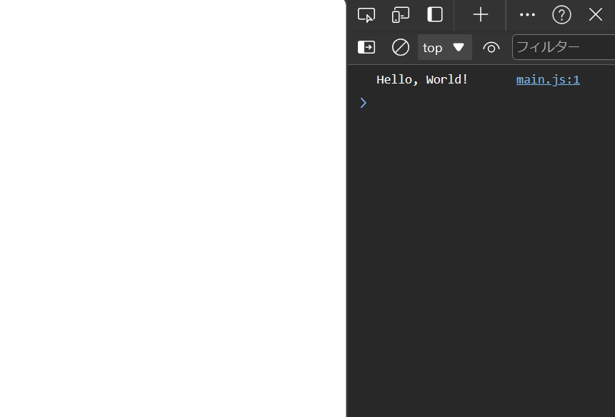
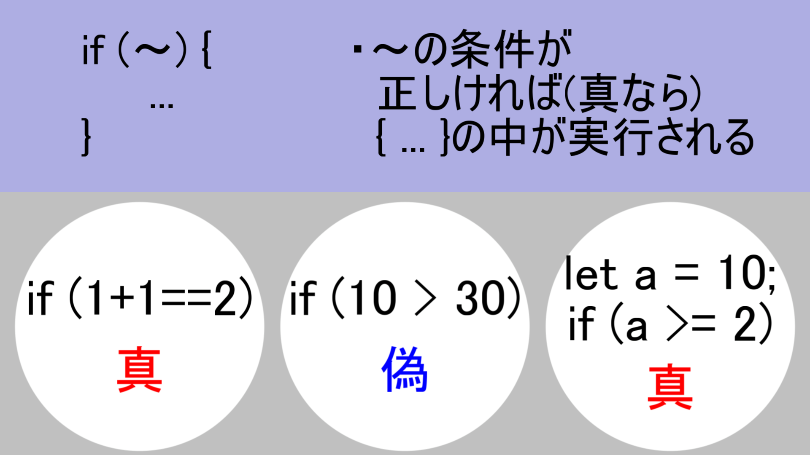

---
var:
    header-title: "オンラインテキストテンプレート"
    header-date: "2024/04/23"
---

# JavaScript でゲームを作ろう

## 概要

### 前回の復習

-   CSS の装飾について学んだ

### 今回の講義の達成目標

<div class="note type-intro">
**達成目標**

・JavaScript の基本的な記述方法を学ぼう。

</div>

## はじめに

-   今回は、JavaScript の基礎について学ぶ。
-   HTML に動的な動作を加えるには、<u>JavaScript</u>を使うと便利である。
-   ひとまず、JavaScript が動作するかの確認をしてみよう。

-   これまで作成してきたファイルを同じ手順で、HTML があるフォルダーと同じ階層に**main.js**という名前のファイルを作成しよう。
    拡張子が**.js**となるものが JavaScript として認識されます。

-   試しに、作った JavaScript ファイルに、このように書いてみよう。
    (詳しい説明は後ほど行います)

```javascript{.numberLines caption="main.js"}
alert(10);
```

-   ただし、これだけでは、HTML にこの JavaScript ファイルを読み込んでくれない。
    なので、HTML の**body**内にこのように書いて読み込ませる必要がある。

```html{caption="index.html"}
<script src="main.js"></script>
```

-   この**script**タグで、JavaScript を読み込んでくれるようになり、**src**属性で、どの JavaScript ファイルを読み込むかを記述する。

---

-   この HTML を読み込むと、以下の画像のようなものが表示される。
    この画面が表示されたら成功である。


<div class="note type-tips">
表示される画面はブラウザによって異なるが、**10**が表示されていればOK
</div>

ここで、次に先程の JavaScript ファイルをこのように変えてみよう。

```javascript{.numberLines caption="main.js"}
alert(30);
```

-   10 だったところを 30 に変えてみた。
    こうするとどうなるか予想してみよう！

-   答え
    <span class="masked">
    10 の表示が 30 に変わる
    </span>

---

-   とりあえず今は<br><em>「alert();と書いて、括弧の中に書いたものが表示される」</em>という考え方で OK

<div class="note type-quiz">
Q. このように記述すると、以下のどれが表示されるか選べ。
```javascript{.numberLines caption="main.js"}
alert(100);
```
<div class="quizes">
<div class="options">
<div class="option incorrect">1</div>
  <div class="option incorrect">10</div>
  <div class="option correct">100</div>
  <div class="option incorrect">1000</div>
</div>
<div class="answercontent">
括弧の中に書いたものが表示されるため、<u>100</u>が正解です。
</div>
</div>

</div>

## 変数

-   プログラミングにおいて、変数はデータを格納するための箱のようなものです。変数には値を代入して保持し、後でその値を参照したり変更したりすることができます。

-   JavaScript では、変数を宣言する際、 `let` や `const`、`var` のキーワードを使用します。それぞれの違いについては後述します。

-   例えば、以下のように変数を宣言して値を代入することができます。

```javascript{.numberLines caption="main.js"}
let age = 30; // 数値型の変数
let name = "Alice"; // 文字列型の変数
const PI = 3.14; // 定数の宣言
```

-   変数を使用することで、同じ値を繰り返し使用したり、値を保持しておいて後で利用することができます。

### 変数の種類

1. `let`: 変数を宣言する際に使用されるキーワード。再代入が可能な変数を宣言する際に使用します。

2. `const`: 定数を宣言する際に使用されるキーワード。一度値を代入すると後から変更できません。

3. `var`: 古いバージョンの JavaScript で使用されていた変数宣言キーワード。`let` や `const` の使用が推奨されています。

-   変数を使うことで、データを保持し、処理を行う際に柔軟に値を扱うことができます。次のセクションでは、変数を使用した実践的な例を見ていきましょう。

```javascript{.numberLines caption="main.js"}
let age = 30; // 数値型の変数
console.log(age); // --> 30
```

-   このように記述すると、先程宣言した age の内容が出力されます。

-   そうです。<u>宣言した内容を記憶してくれます。</u>

-   また、`let`だと、後ほど変更することも可能です。

```javascript{.numberLines caption="main.js"}
let age = 30; // 数値型の変数
console.log(age); // -->30

age = 31;
console.log(age); // -->31
```

### let と const の違い

-   let は、宣言した後でも、後ほど変更することが可能ですが、const は、<u>一度宣言すると内容を変更することができません。</u>
    変更されることがないようなときに使用します。

```javascript{.numberLines caption="main.js"}
const age = 30; // 数値型の定数
console.log(age); // -->30

age = 31; // --> エラー
console.log(age);
```

<div class="note type-quiz">
Q. このように記述すると、以下のどれがコンソールに表示されるか予想してみよう。
```javascript{.numberLines caption="main.js"}
let a = 0;
console.log(A);
```
<div class="quizes">
<div class="options">
  <div class="option incorrect">0</div>
  <div class="option incorrect">A</div>
  <div class="option correct">エラー</div>
</div>
<div class="answercontent">
実は、<em>変数は大文字と小文字も区別します。</em>そのためAという変数が宣言されておらず、「Aが定義されていない」というエラーが表示されます。
</div>
</div>

</div>

## 数値型

### 数値型とは

-   さて、先程「10」や「30」と入力してきましたが、これらのことをプログラミングでは<em>数値型</em>と言います。

-   それでは、今度は四則演算を行っていきたいのですが、その前に今度は`console.log();`というものを使っていきます。

-   ひとまず、以下のコードを書いてみよう。

```javascript{.numberLines caption="main.js"}
console.log(10);
```

-   これを保存して HTML を読み込んでも、一見変化がないように見える。
-   ここで、`F12キー`を押してみよう。すると、いかにも「自分プログラミングしてる！」て感じの画面が出てきます。(初回は開くかどうか尋ねられることもあるので、その場合は許可をしよう)


-   そして、ここに表示されている「10」が、今回私たちが入力したものである。
    この画面のことを<em>コンソール</em>と言う。

### 加算と減算

-   足し算をしたい場合は`+`、引き算は`-`を使用する。

```javascript{.numberLines caption="main.js"}
console.log(10 + 2); // --> 12
console.log(10 - 2); // --> 8
```

### 乗算

-   かけ算をしたい場合は ×... と思いきや`*`(アスタリスク)を使用する。

```javascript{.numberLines caption="main.js"}
console.log(10 * 2); // --> 20
```

### 割り算

-   割り算をしたい場合は`/`を使用する。

```javascript{.numberLines caption="main.js"}
console.log(10 / 2); // --> 5
```

### 余り(余剰)

-   割り算をしたときの余りが欲しい場合は`%`を使用する。

```javascript{.numberLines caption="main.js"}
console.log(10 % 2); // --> 0
```

### 四則演算のルール

-   計算に関しては、括弧を使うことで、加算・減算を優先させることができる。

```javascript{.numberLines caption="main.js"}
console.log( 1 + 2  * 3); // --> 7
console.log((1 + 2) * 3); // --> 9
```

<br>

<div class="note type-caution">
括弧が重なる場合でも、中括弧や大括弧は使用せず、全て括弧で囲おう。
中括弧や大括弧だと別の意味として扱われてしまいます。
<br>
例：{(1 + 2) / 3} × 4 (= 4)を計算したい場合
```javascript{.numberLines caption="main.js"}
console.log( {(1 + 2) / 3} * 4 ); // --> エラー
console.log( ((1 + 2) / 3) * 4 ); // --> 4
```
</div>

<br>

<div class="note type-quiz">
Q. このように記述すると、以下のどれがコンソールに表示されるか選べ。
```javascript{.numberLines caption="main.js"}
console.log((300 + 20) % 10);
```
<div class="quizes">
<div class="options">
  <div class="option incorrect">320</div>
  <div class="option incorrect">32</div>
  <div class="option correct">0</div>
  <div class="option incorrect">3</div>
</div>
<div class="answercontent">
300 + 20は320となり、そこから10で割った余り(余剰)を出力するので、答えは<u>0</u>となります。
</div>
</div>

</div>

## 文字列

-   数字ばかり出力させても面白くないですよね。ということで、次は文字を出力させてみよう！(文字も面白いかと言われると微妙だけど...)

### 文字列とは

-   プログラミングにて、文字のことを<em>文字列</em>と言います。

-   JavaScript における文字列とは、テキストデータを表現するためのデータ型です。文字列は、シングルクォート `'` もしくはダブルクォート `"` で囲むことで表現されます。

-   試しに、「Hello, World!」という文字をコンソールに出力してみましょう。

```javascript{.numberLines caption="main.js"}
console.log("Hello, World!");
```

-   これで HTML を開くと、このようになる。



-   `'`や`"`で囲ったものを文字列として扱われます。

<div class="note type-senior">
「'」や「"」を文字列として扱うには

主なやり方は 2 種類あります。

1. 囲ったものはもう片方の方で記述する。

```javascript{.numberLines caption="main.js"}
// シングルクォートで囲った場合はダブルクォートで
console.log('A"B"C'); // --> A"B"C

// ダブルクォートで囲った場合はシングルクォートで
console.log("I'm fine."); // --> I'm fine.
```

2. <em>バックスラッシュ\\</em>を手前に書く。

```javascript{.numberLines caption="main.js"}
console.log("A\"B\'C"); // --> A"B'C
```

</div>

### 文字列と変数の組み合わせ

-   JavaScript では、文字列と変数を組み合わせて使うことができます。
-   ここでは、文字列と変数を組み合わせる方法を 2 つ紹介します。

#### 文字列連結（+ を使う方法）

-   文字列同士や変数を `+（プラス記号）` で繋ぎ合わせます。

```javascript{.numberLines caption="main.js"}
let name = "太郎";
console.log("こんにちは、" + name + "さん！"); // --> "こんにちは、太郎さん！"
```

<div class="note type-caution">
- 注意点: 空白スペースを忘れずに追加する必要があります。
</div>

#### テンプレートリテラル（バッククォート ``` を使う方法）

-   テンプレートリテラル を使うと、文字列を簡潔かつ読みやすく書けます。
-   変数を埋め込むには <em>${}</em> を使います。

```javascript{.numberLines caption="main.js"}
let name = "太郎";
console.log(`こんにちは、${name}さん！`); // --> "こんにちは、太郎さん！"
```

-   メリット: 複雑な文字列でも簡単に記述できる。
-   バッククォート <em>``</em> を使う点が通常の文字列と異なります。

## 配列

-   配列は、複数のデータをまとめて管理できる「入れ物」のようなものです。
-   例えば、1 人の名前だけでなく、クラス全員の名前を 1 つにまとめて扱いたいときに使えます。

-   また、配列の 1 番はじめは 0 番目となるため注意する必要があります。

```javascript{.numberLines caption="main.js"}
let array = ["田中", "鈴木", "佐藤"];

console.log(array[1]); // --> 鈴木
```

## 関数

### 関数の基本

-   プログラミングにおいて、関数は特定の処理をまとめて再利用可能な形で定義するための仕組みです。関数を使用することで、同じ処理を繰り返し記述する必要がなくなり、コードの再利用性や保守性が向上します。

-   JavaScript において、関数は以下のように定義されます。

```javascript{.numberLines caption="main.js"}
// 関数の宣言
function greet() {
  console.log("Hello, World!");
}

// 関数の呼び出し
greet();
```

-   上記の例では、`greet` という関数が定義されており、その中で `"Hello, World!"` というメッセージがコンソールに出力されます。関数を呼び出すことで、定義された処理が実行されます。

### 関数のパラメータと戻り値

関数名の括弧内に変数を書くことで、その関数内でその変数を使用することができます。
<em>これをパラメータ(引数)</em>と言います。

```javascript{.numberLines caption="main.js"}
// 関数の宣言
function greet(p) {
  console.log(p);
}

// 関数の呼び出し
greet("Hello, World!");　// --> Hello, World!
```

-   関数はパラメータを受け取り、処理を行った結果を<em>戻り値</em>として返すことができます。パラメータは関数に渡す値であり、戻り値は関数から返される値です。

-   以下は、パラメータと戻り値を持つ関数の例です。

```javascript{.numberLines caption="main.js"}
function add(a, b) {
  // returnの内容が結果として出るようになる
  return a + b;
}

let result = add(5, 3);
console.log(result); // --> 8
```

-   上記の例では、`add` という関数が定義されており、2 つのパラメータ `a` と `b` を受け取り、それらを足した結果を戻り値として返しています。関数を呼び出す際に引数として `5` と `3` を渡し、結果 `8` がコンソールに出力されます。

### 関数のスコープ

-   関数内で宣言された変数はその関数内でのみ有効であり、関数外からはアクセスできません。これを関数スコープと呼びます。

-   関数スコープを示す例を以下に示します。

```javascript{.numberLines caption="main.js"}
function greet() {
  let message = "Hello, World!";
  console.log(message);
}

greet();
console.log(message); // -- > エラー
```

-   上記の例では、`message` 変数は `greet` 関数内で定義されており、関数外からはアクセスできません。関数スコープによって変数のスコープが制限されることで、変数名の衝突や意図しない変更を防ぐことができます。

## 条件分岐

-   条件分岐は、プログラムが特定の条件に応じて異なる処理を行うための構造です。JavaScript では、主に`if`、`else if`、`else`文が使用されます。



```javascript{.numberLines caption="main.js"}
let score = 75;

if (score >= 90) {
    console.log("完璧！！！");
} else if (score >= 80) {
    console.log("すごい！！");
} else if (score >= 70) {
    console.log("いいね！");
} else {
    console.log("もうちょっと！");
}
```

## 繰り返し

-   繰り返し文は、特定の処理を繰り返すときに使う構文です。

### for ループ

-   for ループは、条件が真の間はその中のコードを繰り返すものです。

```javascript{.numberLines caption="main.js"}
for (初期化; 条件; 更新) {
  // 繰り返したい処理
}
```

<div class="note type-intro">
- 初期化: 繰り返しを始める前の準備をする。
- 条件: 繰り返しを続けるかどうかを決める。
- 更新: 繰り返しのたびに行う操作（カウントを増やすなど）。
</div>

-   「1 から 10 までの数字を順番に表示する」などの操作が簡単にできます。

```javascript{.numberLines caption="main.js"}
for (let i = 1; i <= 5; i++) {
  console.log(i);
}

// 出力
/*
1
2
3
4
5
 */
```

-   <em>let i = 1;</em> でカウンタ <em>i</em> を <em>1</em> からスタート。
-   <em>i <= 5</em> の条件が満たされている間、繰り返す。
-   <em>i++</em> で毎回 1 ずつ増やす。

-   配列の中身を繰り返し表示する例

```javascript{.numberLines caption="main.js"}
const fruits = ["りんご", "みかん", "ぶどう"];

for (let i = 0; i < fruits.length; i++) {
  console.log(fruits[i]);
}

// 出力
/*
りんご
みかん
ぶどう
*/
```

配列 fruits の長さ <em>fruits.length</em> だけ繰り返します。
各繰り返しで、`fruits[i]` を取り出して表示します。

### for in ループ

-   for...in は、配列のインデックスを繰り返し処理するために使います。配列の要素を直接取得したい場合は少し注意が必要ですが、基本的にや「インデックス」を操作する場合に使います。

```javascript{.numberLines caption="main.js"}
// 配列
const array;

for (let index in array) {
  // 配列のインデックスを使って何かをする
}
```

-   この方法で、配列から要素を順番に表示させていきます。

```javascript{.numberLines caption="main.js"}
const fruits = ["りんご", "みかん", "ぶどう"];

for (let index in fruits) {
  console.log(`インデックス ${index} の要素: ${fruits[index]}`);
}

// 出力
/*
インデックス 0 の要素: りんご
インデックス 1 の要素: みかん
インデックス 2 の要素: ぶどう
*/
```

-   for...in は fruits 配列のインデックス（0, 1, 2）を順番に取得して、そのインデックスを使って配列の要素を取り出しています。

<div class="note type-caution">
- <em>for...in</em> は、配列のインデックスを取り出すことができますが、配列の順番が保証されない場合があります。特に、配列に追加のプロパティを持たせたりした場合に、順序が保証されないことがあるため、配列の要素を処理したい場合は、<em>for...of</em> を使うことが推奨されます。
</div>

### for of ループ

-   <em>for...of</em> は、配列の`「反復可能オブジェクト（iterable）」`から、要素を 1 つずつ取り出して処理するための構文です。
    配列の中の値を直接扱いたい場合に便利で、for...in や通常の for よりもシンプルで読みやすいです。

```javascript{.numberLines caption="main.js"}
let array; // 配列

for (let 要素 of array) {
  // 各要素に対する処理
}
```

-   配列の要素を繰り返して表示するコードはこのようになります。

```javascript{.numberLines caption="main.js"}
const fruits = ["りんご", "みかん", "ぶどう"];

for (let fruit of fruits) {
  console.log(fruit);
}

// 出力
/*
りんご
みかん
ぶどう
*/
```

<div class="note type-quiz">
Q. このように記述すると、以下のどれがコンソールに表示されるか予想してみよう。（改行はカンマ「,」で表しているものとする）

```javascript{.numberLines caption="main.js"}
const array = [30, 100, 70, 50];

for (let number of array) {
  if (number > 50) {
    console.log(number);
  }
}
```

<div class="quizes">
<div class="options">
  <div class="option incorrect">50, 70, 100</div>
  <div class="option correct">100, 70</div>
  <div class="option incorrect">100, 70, 50</div>
  <div class="option incorrect">70, 100</div>
</div>
<div class="answercontent">
for of ループで<em>array</em>内の要素を0番目から順番に繰り返し、その要素が<em>50より大きい</em>ならコンソールに表示するコードです。
</div>
</div>
</div>

## setTimeout

-   setTimeout は、指定した時間が経ったあとに、一度だけ処理を実行したいときに使います。

```javascript{.numberLines caption="main.js"}
setTimeout(() => {
  // 実行される処理
}, 待機するミリ秒);
```

-   たとえば、「2 秒後にメッセージを表示する」というような動きが簡単に作れます。

```javascript{.numberLines caption="main.js"}
setTimeout(() => {
  console.log("2秒経過");
}, 2000);
```

-   また、<em>setTimeout は変数に代入することが可能</em>です。
-   変数に格納することによって、`clearTimeout`を用いて処理を中断することが可能です。

```javascript{.numberLines caption="main.js"}
// 1. タイマーをセット
let timerID = setTimeout(() => {
  console.log("タイマーが動きました！");
}, 5000); // 5秒後に実行

// 2. タイマーをキャンセル
clearTimeout(timerID);
console.log("タイマーをキャンセルしました！");
```

## setInterval

-   setInterval は、指定した時間が経ったあとに、指定した秒数ごとに処理を実行したいときに使います。

```javascript{.numberLines caption="main.js"}
setInterval(() => {
  // 実行される処理
}, 待機するミリ秒);
```

-   たとえば、「2 秒ごとにメッセージを表示する」というような動きが簡単に作れます。

```javascript{.numberLines caption="main.js"}
setInterval(() => {
  console.log("2秒経過");
}, 2000);
```

-   また、<em>setInterval も同様に変数に代入することが可能</em>です。
-   変数に格納することによって、`clearInterval`を用いて処理を中断することが可能です。

```javascript{.numberLines caption="main.js"}
// 1. 5秒ごとに実行されるタイマーをセット
let timerID = setInterval(() => {
  console.log("タイマーが動きました！");
}, 5000); // 5秒後に実行

// 2. タイマーをキャンセル
clearInterval(timerID);
console.log("タイマーをキャンセルしました！");
```

-   ここで、変数や関数などの基本的な解説は終了です。
